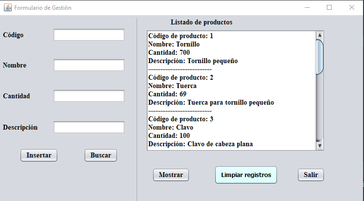

# CrudFicheroJava
Lectura y escritura desde un fichero .txt con java. El proyecto consiste en crear, modificar y eliminar artículos desde el fichero, para ello se utiliza la interfaz gráfica Java Swing.

